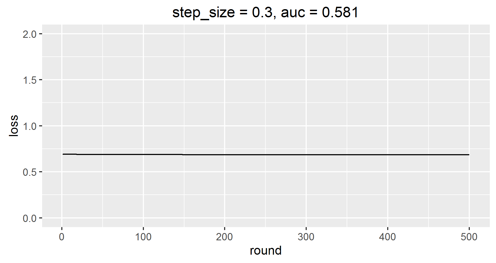
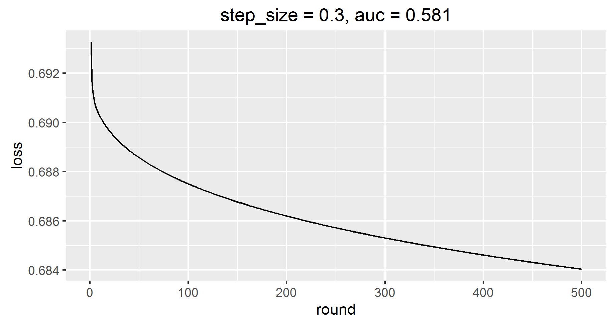

## (2010)Factorization Machines

一种分类器，可以处理非常稀疏的超大矩阵，而SVM不行。与核函数为多项式的SVM的工作原理类似。本质上是考虑了多个变量之间的交互。

相关参考

* [美团FFM](http://tech.meituan.com/deep-understanding-of-ffm-principles-and-practices.html)
* [新浪FM/FFM](http://www.52caml.com/head_first_ml/ml-chapter9-factorization-family/#)


https://github.com/Intel-bigdata/FM-Spark

http://tech.meituan.com/deep-understanding-of-ffm-principles-and-practices.html


http://blog.csdn.net/itplus/article/details/40534885

https://getstream.io/blog/factorization-machines-recommendation-systems/

http://baogege.info/2014/10/19/matrix-factorization-in-recommender-systems/

线性回归算法
http://blog.kamidox.com/gradient-descent.html


如果作为分类器，需要使用Logit Loss函数作为损失函数，定义如下

$$
  L(\theta) = \ln{(1+e^{-yf(x,\theta)})}, y \in \{-1,1\},f(x,\theta)
$$

可以使线性回归，也可以是FM


对Logit Loss求导

$$
  \frac{\partial L}{\partial \theta_i} =  \frac{-ye^{-yf(x,\theta)}}{1+e^{-yf(x,\theta)}} \frac{\partial f(x,\theta)}{\partial \theta_i} = \frac{-y}{1+e^{yf(x,\theta)}}    \frac{\partial f(x,\theta)}{\partial \theta_i} =  -y(1-\frac{1}{1+e^{-yf(x,\theta)}})\frac{\partial f(x,\theta)}{\partial \theta_i}
$$

Logit Loss就是Cross Extropy把sigmoid函数代入后的形式，参考[这篇文章](https://www.codelast.com/%E5%8E%9F%E5%88%9B-%E7%94%A8%E4%BA%BA%E8%AF%9D%E8%A7%A3%E9%87%8A%E6%9C%BA%E5%99%A8%E5%AD%A6%E4%B9%A0%E4%B8%AD%E7%9A%84logistic-regression%EF%BC%88%E9%80%BB%E8%BE%91%E5%9B%9E%E5%BD%92%EF%BC%89/)。


了解fm
还要找fm 二元分类实现


km上有一篇文章，[SNG使用FM做的推荐](http://km.oa.com/group/22605/articles/show/292186?kmref=search&from_page=1&no=5),基于github上的一个[spark-libFM](https://github.com/zhengruifeng/spark-libFM/blob/master/src/main/scala/org/apache/spark/mllib/regression/FactorizationMachine.scala)开源实现修改的，使用了logit loss和cross entropy两个函数，线上效果后者较好，后面可以尝试。

[spark-libFM](https://github.com/zhengruifeng/spark-libFM/blob/master/src/main/scala/org/apache/spark/mllib/regression/FactorizationMachine.scala)直接使用的spark mllib优化器，我只需要实现梯度就可以了，太棒了！可以获取中间输出结果，得到是否收敛。已经实现了二元梯度，看看梯度的实现。

上面的源代码已分析完成，已经导入到spark 2.0环境，并且在github上创建[libFM](https://github.com/bourneli/libFM),后面的工作，就是在lol数据上试验，并且改进现有代码，添加新的特性。


## 调参遇到的问题

### step size设置太小

导致执行n轮后，loss基本没有减少，原地踏步。最开始设置的为0.0001，后来设置为0.3后，loss有明显收敛。

### loss curve绘制

loss curve有明显的缩小，但是需要设置y的比例才能看出来，最开始，用下面的代码设置y的比例，得到的结果

```
p <- qplot(x=round,y=loss, data = loss, geom = 'line')
p <- p + scale_y_continuous(limits = c(0,2))
p <- p + ggtitle('step_size = 0.3, auc = 0.581')
p
ggsave(p,file='loss_curve_unclear.png')
```



基本看不到损失，当注释了y的比例设置后，结果是这样

```
p <- qplot(x=round,y=loss, data = loss, geom = 'line')
# p <- p + scale_y_continuous(limits = c(0,2))
p <- p + ggtitle('step_size = 0.3, auc = 0.581')
p
ggsave(p,file='loss_curve_clear.png')
```


loss收敛效果明显！！！！


### k取值

Final Result
stepSize,k,r1,r2,auc
1.0,20.0,0.0,0.01,0.5835409103108341
1.0,50.0,0.0,0.01,0.5835445662436813
1.0,100.0,0.0,0.01,0.5835465886746188


k基本没有区别，所以取最小的


可以添加动量，加速收敛。
