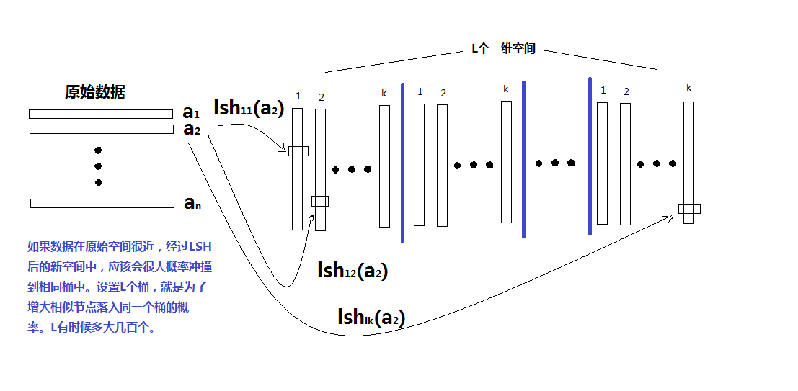
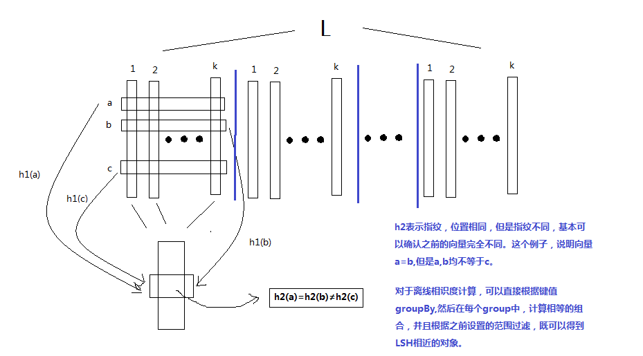

 <!--MathJax数学公式-->

## Locality-Sensitive Hashing：相似的数据，距离近

[Nearest neighbors in high-dimensional data?](http://stackoverflow.com/a/5773066/1114397)介绍了使用LSH(Locality-Sensitive Hashing)来做ANN(Approximate Nearest Neighbor)。LSH就是将相似的对象hash到一起，然后就可以在邻域域得到大致的邻居个数。

[局部敏感哈希(Locality-Sensitive Hashing, LSH)方法介绍](http://blog.csdn.net/icvpr/article/details/12342159)讲得比较清晰，中文阅读效率高。这篇文章没有讲错误评估的推导，但是过程讲的比较清楚，且比较全面。

Github上有个[LSH的实现](https://github.com/mrsqueeze/spark-hash)，该算法基于[Mining of Massive Datasets](http://mmds.org/)第三章的内容实现。此章节对LSH整个框架介绍很详细，但是对基于欧式距离的例子没有。

ANN还可以应用在物品推荐，如果你买了一个进口蜂蜜A，可以推荐相识的进口蜂蜜B。

有两个重要指标

* False Positive:不想同的数据放到了一块
* False Negative:相同的数据没有放到一块

将minhash的签名，通过banding，带状分隔。得到的数据，给了多次hash的尝试，只有这多次都一样，才认为是一样的，这样即使在部分band中有冲撞，也不会太碍事。

算法需要上面两个指标都尽可能小，但是一般只能权衡。

## Minhash：压缩集合，但保留相似性

minhash的期望与杰卡德像适度一致，做n次minhash（相当于n次随机试验，均值越来越趋近于期望，并且方差越来越小）得到签名，如果两个集合的签名一致，那么这两个结合就越相识。

minhash需要随机排序，在数以亿计的集合中，那是相当耗时的，但是可以使用hash函数，模拟随机排序过程。最终，minhash生成的签名可以保留原始集合的**相似度**，但是却极大的减少了集合的**存储空间**。

## (2004)Locality-Sensitive Hashing Scheme Based on p-Stable.pdf

LSH在欧式空间的探讨。

稳定分布，无法给出[概率密度解析表达式](http://www.swarmagents.cn/bs/files/jake2011616211724.pdf)。

[概率公式证明](http://blog.sina.com.cn/s/blog_67914f2901019p3v.html)

[概率密度乘法wiki](https://en.wikipedia.org/wiki/Probability_density_function)

[概率密度乘法的问题](http://math.stackexchange.com/a/275668/261790)

## 基于欧式空间的LSH总结
示意图如下

**邻近hash**

**检索**

