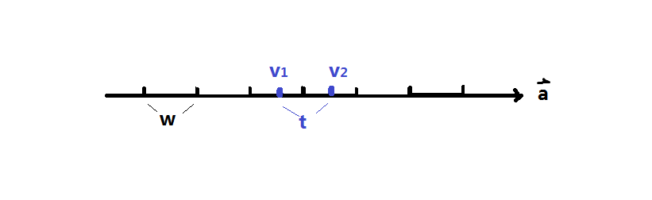
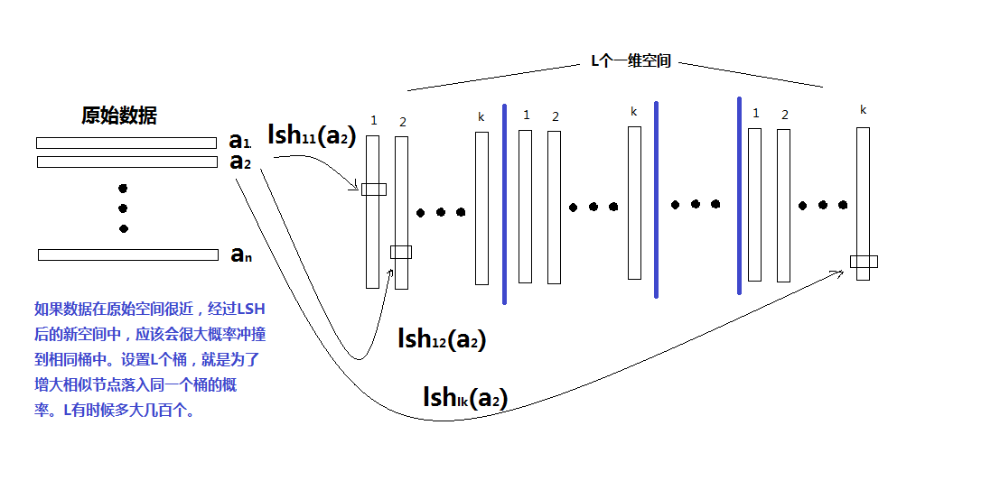
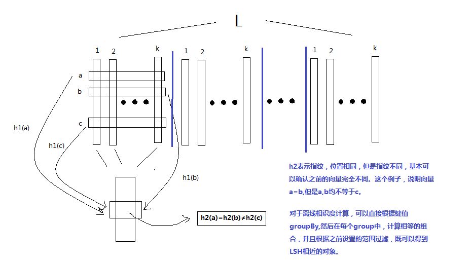

## 大纲

* 应用背景
* 计算方法
* 实现与优化


## 应用背景

在很多应用领域中，我们面对和需要处理的数据往往是海量并且具有很高的维度，怎样快速地从海量的高维数据集合中找到与某个数据最相似（距离最近）的一个数据或多个数据成为了一个难点和问题。

LSH主要解决**高纬度最邻近查找**问题，是一种**近似**算法，时间复杂度为**线性**，可大规模应用。应用场景举例：

1. 查找网络上的重复网页
2. 查找相似新闻网页或文章
3. 音乐检索
4. 指纹匹配
5. 图像检索

## 计算方法--核心思想

主要思路是设计一类hash函数，将那些比较类似的对象hash到一起，不同的对象的hash到不同的地方。hash过程相当于一种**过滤**机制，缩小检索范围。

最近邻居蛮力计算方法需要的时间复杂度$O(n^2)$，而使用LSH，可以在保证错误率很低的情况下，时间复杂度降到$O(n)$。在不需要准确最近邻居的应用场景，可以大规模应用，比如$n$达到亿级甚至更多。


## 计算方法--$(r_1,r_2,p_1,p_2)-sensitive$

定义：函数集合$H=\lbrace h: S \rightarrow U \rbrace$；任意向量$q,v \in S$；U是整数集合；$B(v,r) = \lbrace q \in X \| d(v,q) \le r \rbrace$，表示以点$v$为中心，距离为r范围内的所有点的集合。

$$
	如果 v \in B(q, r1), P(h(v)=h(q)) \ge p1 \\
	如果 v \notin B(q, r2), P(h(v)=h(q)) \le p2
$$

符合上述条件的函数h被称为$(r_1,r_2,p_1,p_2)-sensitive$。

直观解释就是将相距较近($r_1$以内)的向量hash到一起的概率要大($p_1$较接近1)；距离较远($r_2$以外，且$r_2 > r_1$)的对象hash到一起的概率小($p_2$较接近0)。


## 计算方法--欧式空间的LSH局部敏感函数

将n维向量随机射到一个向量，使用向量点乘，由于投射向量不是单位向量，所以严格意义上不能称之为投影。投射hash算法如下:

$$
	h(v) = \left\lfloor \frac{a \bullet v + b}{w} \right\rfloor
$$

其中

* $b \in [0,w]$是随机量，
* $a \in R^n,a_i \sim N(0,1)$，是被投射的向量。

$w$将投射结果严格的划分为不同的单位，$w$十分重要！

* 太大，较远的对象也设hash到一个单位里，计算量仍然十分大；
* 太小，很近的对象也无法hash到一起，导致找不到相似的对象。

## 计算方法--欧式空间的LSH投影示意图




## 计算方法--常系数的概率密度函数变换

如果$X$与$cY$的分布相同,$c$为常数，并且已知X的概率密度$f_X(x)$,计算Y的概率密度函数$f_Y(y)$?推导如下：

$$
	F_X(x)=Pr(X \le x)=\int_{-\infty}^x f_X(t)dt 
	\Rightarrow f_X(x) = \frac{d F_X(x)}{dx} \qquad(1)
$$


$$
	F_Y(y) = Pr(Y \le y) 
           = Pr(cX \le y) 
           = Pr(X \le \frac{y}{c}) 
           = F_X(\frac{y}{c})  \qquad (2)
$$


$$
	f_Y(y) = \frac{d F_X(\frac{y}{c})}{dy} =  \frac{1}{c} f_X(\frac{y}{c}) \qquad(3)
$$

核心思想是将概率密度函数转成累积分布概率函数，概率密度任意一点的概率为0。


## 计算方法--稳定分布

如果分布D是稳定分布，那么必须满足任意n个D的独立同部分(iid)随机变量$X_1,X_2,\cdots,X_n$，在任意n个实数$v_1,v_2,\cdots,v_n$，有$\sum_{i=1}^{n}{(v_iX_i)}$与$(\sum{\|v_i\|^s})^{\frac{1}{s}}X$(X也是D的一个随机变量)有相同的分布。

* 当s=1时，表示向量点积与向量曼哈顿距离的关系。
* 当s=2时，表示向量点积与欧式距离的关系。并且此时D是标准正太分布。

## 计算方法--欧式空间LSH函数概率分析

任意两向量$v_1$,$v_2$投射到a上的距离为t

  $$
  t=a\bullet v_1 - a \bullet v_2=a(v_1-v_2)=\sum{a_i(v_{1i}-v_{2i})}
  $$

当$\|t\| \le w$，且$t>0$时，碰撞概率为$1-\frac{t}{w}$。

令$u=(\sum{\|v_{1i}-v_{2i}\|^2})^{\frac{1}{2}}$,那么$t=ua$,且$f_A(a)=\frac{1}{\sqrt{2\pi}}e^{-\frac{a^2}{2}}$,导出$f_T(t)=\frac{1}{u}f_A(\frac{t}{u})$。对于任意t的概率为$\frac{1}{u}f_A(\frac{t}{u})dt$。

碰撞概率公式

$$
  p(w,u)=2\int_0^w\frac{1}{u}f_A(\frac{t}{u})(1-\frac{t}{w})dt
$$

当$t \in [-w,0]$时，概率与$[0,w]$一致，所以乘以2；其他范围概率均为0。


## 计算方法--碰撞概率单调性与参数估计

碰撞概率概率解析形式

$$
\begin{align}
p(w,u) &= Pr(h(p) = h(q)) \\ 
&=2\int_{0}^{w}\frac{1}{u}f_A(\frac{t}{u})(1-\frac{t}{w})dt \\
&=1 - 2F(-\frac{w}{u}) + \sqrt{\frac{2}{\pi}}\frac{u}{w}(e^{-\frac{w^2}{2u^2}}-1) \\
\end{align}
$$

令$c=\frac{u}{w}$，
 
$$
	p(w,u) = g(c) = 1 - 2F(-\frac{1}{c}) + \sqrt{\frac{2}{\pi}}c(e^{-\frac{1}{2c^2}}-1) 
$$


**概率只与w,u的比例有关，与绝对距离无关。** 

## 计算方法--碰撞概率函数单调性

概率函数导数
$g\prime(c) = \sqrt{\frac{2}{\pi}}(e^{-\frac{1}{2c^2}}-1) < 0$

```{r pdf_decrease,message=FALSE,echo=FALSE,fig.align='center',fig.height=4}
pr <- function(c) {
  1-2*pnorm(-1/c) + (2*c/sqrt(2*pi))*(exp(-1/(2*c^2))-1)
}

x <- seq(0,10,by=0.01)
d <- data.frame(x=x,y=sapply(x,pr))

require(ggplot2)
text_size <- element_text(size = 19)
p <- qplot(x,100*y,data=d, geom="line") + xlab("c") + ylab("概率%") + ggtitle("") 
p <- p + scale_x_continuous(breaks=0:10)
p <- p + scale_y_continuous(breaks=seq(0,100,by=10))
p <- p + theme(axis.text = text_size,  axis.title = text_size)
p
```

**w固定，u越大，碰撞概率越低，符合直觉**。


## 计算方法--估算w

给定$r_1=0.01,r_2=1.3,p_1 = 0.97, p_2 = 0.1$,根据单调性，可以得到w的范围，

$$
  \frac{r_1}{w} \le c_1, c_2 \le \frac{r_2}{w} \Rightarrow \frac{r_1}{g^{-1}(p_1)} \le w \le \frac{r_2}{g^{-1}(p_2)} 
  \Rightarrow 0.27 \le w \le 0.33
$$


* 如果没有倾向性，选取区间的中间。
* 如果需要对相近的用户进行更严格的限制，w取下限
* 如果对比较远的用户有严格的限制，w可以取上限。

并不是所有的参数都可以得到合适的w，比如上面的$p_2=0.05$，那么上界是0.16，**小于下界**，得不到合适的w。

## 计算方法--LSH强化

思路：使用**逻辑与**和**逻辑或**提高LSH函数的上界，降低LSH的下界。

**逻辑与** $(r_1, r_2, p_1^r, p_2^r) - sensitive$

**逻辑或** $(r_1, r_2, 1-(1-p_1)^r, 1-(1-p_2)^r) - sensitive$

**逻辑与嵌套逻辑或** $(r_1, r_2, 1-(1-p_1^k)^L, 1-(1-p_2^k)^L) - sensitive$

去掉那些碰巧hash到一起的情况，如果真的很近，在L组计算中，总有一组k个hash均相等。


## 计算方法--估算L

k用来避免局部组合爆炸，一般$k = 10$。在k固定时，需要估算适当的L和组合后的概率。令组合$\rho_1,\rho_2$为强化后的上下界，

$$
  \rho_1 \le 1-(1-p_1^k)^L, \rho_2 \ge 1-(1-p_2^k)^L
$$

所以可以得到L的范围

$$
   \frac{\ln{(1-\rho_1)}}{\ln{(1-p_1^k)}} \le L \le \frac{\ln{(1-\rho_2)}}{\ln{(1-p_2^k)}}
$$

与w一样，并不是所有的目标都可以达到。假设目标是$\rho_1=0.99 > 0.97, \rho_2=0.01 < 0.1$,L至少为6可以达到此目标。

## 应用与实践--建表示意图




## 应用与实践--查询示意图


## 应用与实践--概况

使用spark实现离线版本（spark无法实现在线查询版本）。

$3千万 \times 15$的数据，耗时13小时，得到138亿相似对。spark集群配置如下

    num-executors 100
    driver-memory 1G
    executor-cores 2
    executor-memory 10G
    spark.default.parallelism=200
    spark.storage.memoryFraction=0.8
    spark.yarn.allocation.executor.maxMemory=35G
    spark.driver.maxResultSize=4G

## 应用与实践--优化1：分布合并hash桶

LSH算法在每个桶中，需要按k个键合并。总共需要合并L个hash桶。最开始是先分别将L个桶计算完后，然后合并去重。这样需要同时将L个桶的数据保存在内存中，非常消耗空间。所以，优化的方法是按每n(<L)个桶合并，这样最多也只需要同事保留n个hash桶的空间。

[源代码参考这里](http://git.oa.com/bourneli/my_dm_ml_library/blob/master/src/main/scala/org/apache/spark/mllib/lsh/tencent/LSHForE2.scala#L132)


## 应用与实践--优化2：巨片随机化

在LSH过程中，如果数据分布非常集中，那么必然导致hash桶中一个hash key上聚集非常多的数据。比如在我的试验数据中，300万的数据，有一个hash key上聚集了1.7万的数据，称此现象为巨片。如果对这些数据进行排列组合，那么单个partition的突破spark 2GB限制，导致计算异常结束。解决方法是设置一个阀值，如果单个key聚集的对象数量高于这个阀值，就随机取样少量相识对象。这样效果不会太差，因为能够聚到一起的，说明本来就很相似。但是效率却得到了极大提升。

[源代码参考这里](http://git.oa.com/bourneli/my_dm_ml_library/blob/master/src/main/scala/org/apache/spark/mllib/lsh/tencent/LSHForE2.scala#L110)

## 应用与实践--优化3：数据id变成整型

有些数据的id是字符串型，该数据十分消耗内存，建议通过hash的方法将其转成整型。比如我的试验数据集合，原始id是32个字符串，通过hash变成Long后，只有8个字节，空间节省了75%。虽然hash过程中可能存在一定冲撞，但应是小概率时间，可以忽略。

[源代码参考这里](http://git.oa.com/bourneli/my_dm_ml_library/blob/master/src/main/scala/org/apache/spark/mllib/lsh/tencent/LSHForE2.scala#L44)


## 应用与实践--优化4：减少频繁Iterable转IndexedSeq

这个地方是没有注意的细节，修改后效率极大提升，所以还是记录于此。GroupByKey后得到的对象是Iterable，**无法随机访问**，必须转成IndexedSeq对象。修改之前，每次都在随机访问时转成IndexedSeq，相当消耗性能，尤其部分倾斜的分区计算相当滞后。修改后，只转换一次IndexedSeq，后续访问重复利用，性能得到了极大的提升。
 
[源代码参考这里](http://git.oa.com/bourneli/my_dm_ml_library/blob/master/src/main/scala/org/apache/spark/mllib/lsh/tencent/LSHForE2.scala#L115) 

## 应用与实践--优化5：手动Hash分区

这个问题可以参考[StackoverFlow中问题][4]。在**优化1-分布合并hash桶**时，结果需要调用partitionBy(new HashPartitioner(parts))，将结果转成ShuffledRDD。因为distinct操作可以最大化利用ShuffledRDD的，减少不必要的重新排序和网络传输。

[源代码参考121和138行](http://git.oa.com/bourneli/my_dm_ml_library/blob/master/src/main/scala/org/apache/spark/mllib/lsh/tencent/LSHForE2.scala#L121)

## 参考文献

* [LSH在欧式空间的应用(1)--碰撞概率分析][1]
* [LSH在欧式空间的应用(2)--工作原理][2]
* [LSH在欧式空间的应用(3)--参数选择][3]
* [LSH在欧式空间的应用(4)--算法实现与优化总结][4]
* [StackOverflow spark: How to merge shuffled rdd efficiently?][5]
* [Mining of Massive Datasets,第二版， 3.6.3节](http://www.mmds.org/)
* $E^2$LSH 0.1 User Manual, Alexandr Andoni, Piotr Indyk, June 21, 2005, Section 3.5.2
* (2004)Locality-Sensitive Hashing Scheme Based on p-Stable
* (2008)Locality-Sensitive Hashing for Finding Nearest Neighbors

[1]: http://bourneli.github.io/probability/lsh/2016/09/15/lsh_eulidian_1.html
[2]: http://bourneli.github.io/probability/lsh/2016/09/22/lsh_eulidian_2.html
[3]: http://bourneli.github.io/probability/lsh/2016/09/23/lsh_eulidian_3.html
[4]: http://bourneli.github.io/probability/lsh/2016/10/01/lsh_eulidian_4.html
[5]: http://stackoverflow.com/a/39806633/1114397

## 附录1--碰撞函数推导

$$
\begin{align}
	p(u) = f(u,w) &= 2(\int_{0}^{w}\frac{1}{u}f(\frac{t}{u})dt - \int_{0}^{w}\frac{1}{u}f(\frac{t}{u})\frac{t}{w}dt) \\
				  &= 2(\int_{0}^{w}f(\frac{t}{u})d\frac{t}{u} - \int_{0}^{w}\frac{1}{u\sqrt{2\pi}}e^{-\frac{t^2}{2u^2}}\frac{t}{w}dt) \\
				  &= 2(\int_{0}^{\frac{w}{u}}f(x)dx - \frac{-u}{\sqrt{2\pi}w}\int_{0}^{w}e^{-\frac{t^2}{2u^2}}d(-\frac{t^2}{2u^2})) \\
				  &= 2(\frac{1}{2} - F(-\frac{w}{u}) + \frac{u}{\sqrt{2\pi}w}e^{-\frac{t^2}{2u^2}}|^w_0) \\
				  &= 2(\frac{1}{2} - F(-\frac{w}{u}) + \frac{u}{\sqrt{2\pi}w}(e^{-\frac{w^2}{2u^2}}-1)) \\
\end{align}
$$
 

## 附录2--碰撞函数单调性

$$
	\begin{align}
		g\prime(c) &= -2f(-\frac{1}{c})(-1)(-1)c^{-2} + \sqrt{\frac{2}{\pi}}(e^{-\frac{1}{2c^2}}-1) + \sqrt{\frac{2}{\pi}}c(e^{-\frac{1}{2c^2}}(-\frac{1}{2})(-2)c^{-3}) \\
				   &= -\frac{2}{c^2}f(-\frac{1}{c}) + \sqrt{\frac{2}{\pi}}(e^{-\frac{1}{2c^2}}-1) + \sqrt{\frac{2}{\pi}}e^{-\frac{1}{2c^2}}c^{-2} \\
				   &= -\frac{2}{c^2}\frac{1}{\sqrt{2\pi}}e^{-\frac{1}{2c^2}} + \sqrt{\frac{2}{\pi}}(e^{-\frac{1}{2c^2}}-1) + \sqrt{\frac{2}{\pi}}e^{-\frac{1}{2c^2}}c^{-2} \\
				   &= \sqrt{\frac{2}{\pi}}(e^{-\frac{1}{2c^2}}-1) < 0
	\end{align}
$$

## 附录3--w估计试验

```{r w_param,eval=FALSE}
# 碰撞函数
root_fun <- function(target) {
  function(c) {
    1-2*pnorm(-1/c) + (2*c/sqrt(2*pi))*(exp(-1/(2*c^2))-1) - target
  }
}
# 碰撞函数反函数
g_i <- function(p) {
  uniroot(root_fun(p),lower = 1e-10, upper = 10, tol = 1e-5)$root
}

r1 <- 0.01;r2 <- 1.3
p1 <- 0.97;p2 <- 0.1 #p2 <-  0.05

r1 / g_i(p1) # 下界
r2 / g_i(p2) # 上界

```

## 附录4--L估计试验

```{r L_param,eval=FALSE}
k <- 10
p1 <- 0.97
p2 <-  0.1
rho1 <- 0.99
rho2 <- 0.01

log(1-rho1) / log(1-p1^k)
log(1-rho2) / log(1-p2^k)

L <- ceiling(log(1-rho1) / log(1-p1^k))
L

```